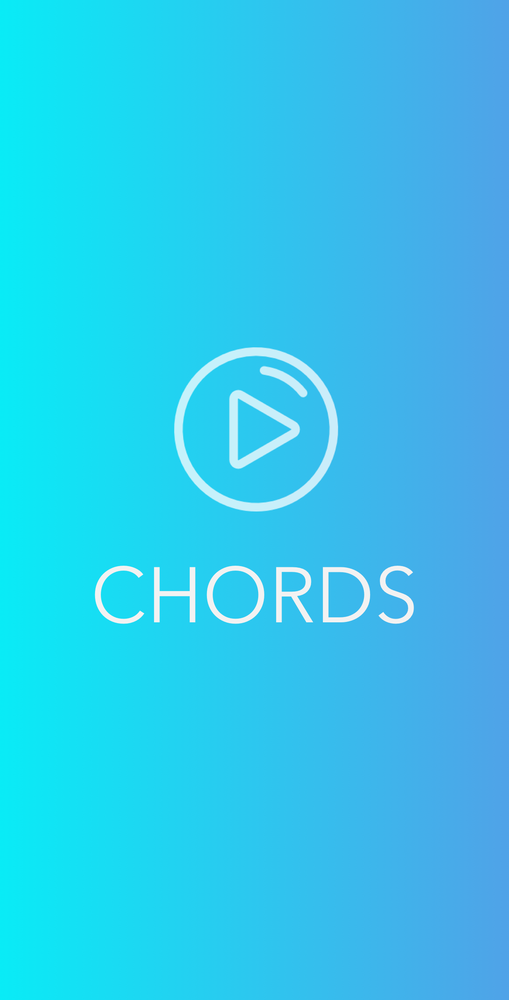

# Chords

  

### Description

Music-app made in React native, where you can experiment with chord progressions etc.

### Technologies

[React Native](https://facebook.github.io/react-native/)

### API

[Hooktheory](https://www.hooktheory.com/api/trends/docs)
